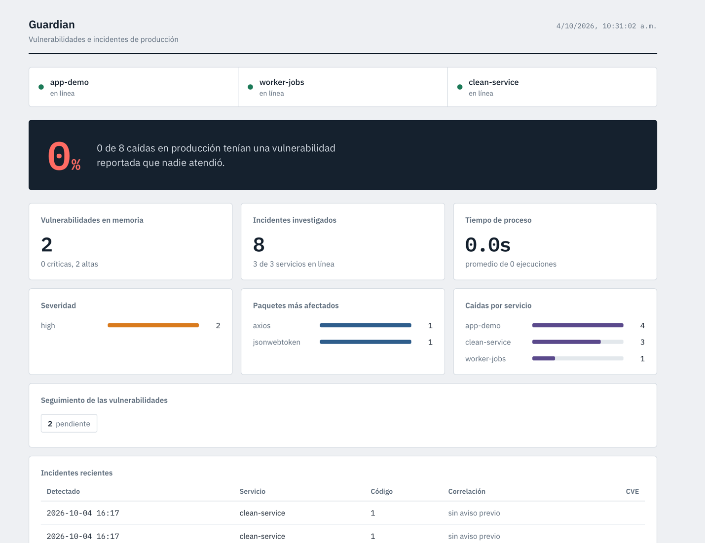
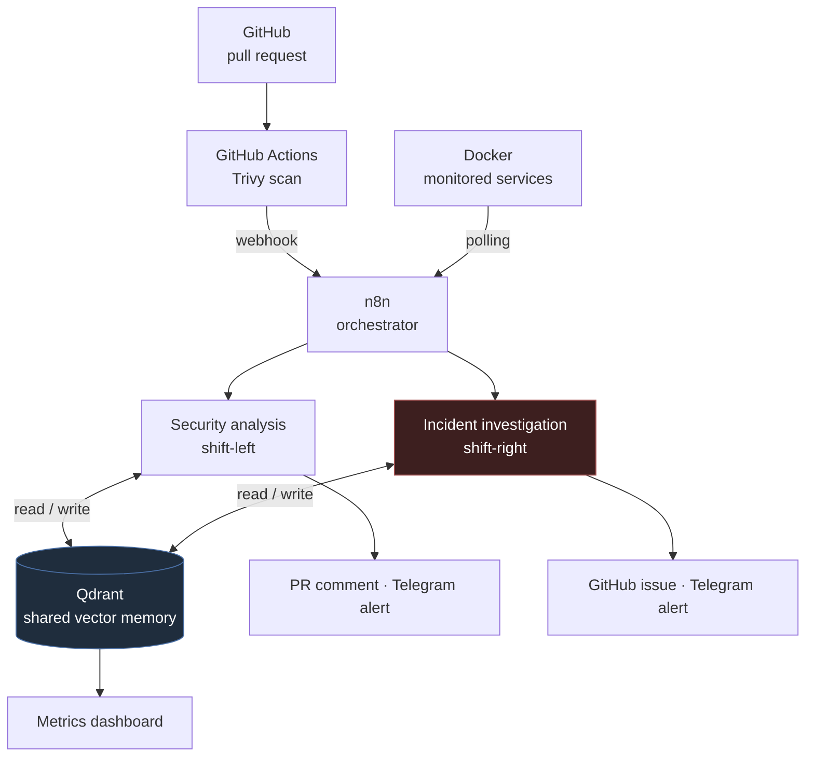
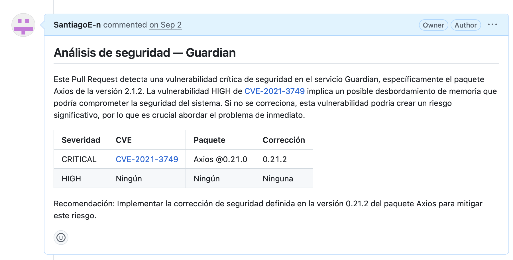
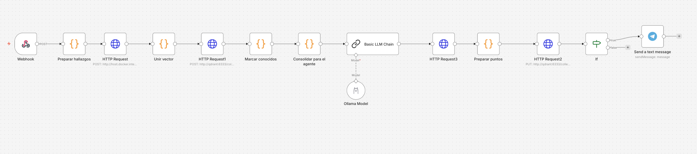
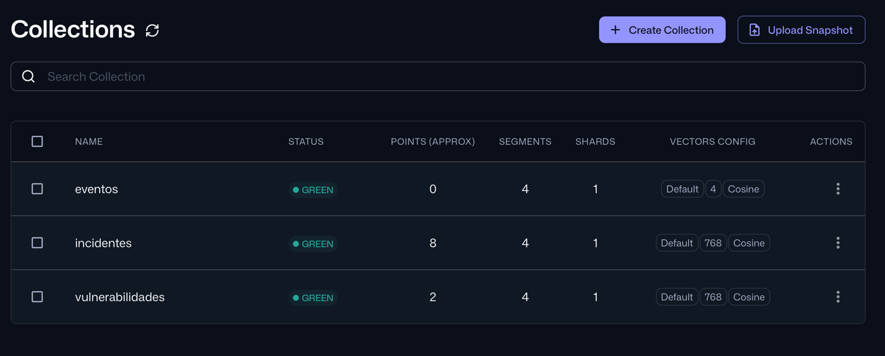

# Guardian

**A DevSecOps platform with memory.** It scans every pull request for vulnerabilities, investigates production incidents on its own, and — because both halves share one vector store — tells you when an outage was caused by a security warning nobody acted on.

Built with n8n, Qdrant, Docker and locally-hosted LLMs. No third-party AI APIs: every model runs on the host machine.



---

## The problem

In most teams, security findings and incident response live in separate worlds.

A scanner flags a vulnerable dependency on a pull request. The team is shipping, the finding gets acknowledged and forgotten. Three weeks later a service crashes at 2am. Whoever is on call reads the logs, restarts the container, writes a short note and moves on. Nobody connects the outage to the warning from three weeks ago — doing so would require someone to recall a specific comment on a specific PR while actively putting out a fire.

The information to prevent the second event already existed before the first one happened. It just wasn't anywhere the incident responder would look.

Guardian closes that loop automatically.

---

## How it works



### Flow 1 — Vulnerability detection (shift-left)

A pull request triggers GitHub Actions, which runs Trivy against the project's dependencies and posts the result to an n8n webhook. From there:

1. Findings are deduplicated and turned into natural-language descriptions
2. Each one is embedded with `nomic-embed-text` and looked up in Qdrant
3. Anything already marked as a false positive is dropped; anything seen before is flagged as a repeat
4. A local LLM writes the summary, which is posted as a PR comment
5. Critical findings also trigger a Telegram alert
6. New findings are written back to memory

### Flow 2 — Incident investigation (shift-right)

A scheduled trigger checks container health every minute through a read-only Docker socket proxy. When a service is down:

1. The container is inspected for its exit code and exact time of death
2. A deterministic incident ID is derived from both, so a service that stays down for an hour still produces exactly one report
3. Logs are pulled, de-multiplexed and filtered for error lines
4. **Two** memory lookups run: one against past incidents, one against known vulnerabilities
5. The LLM writes a post-mortem, published as a GitHub issue and pushed to Telegram

### The bridge

That second lookup is the whole point of the project.

When the incident agent investigates a crash, it searches the same vector store the security agent has been filling for weeks. If it finds an unresolved vulnerability semantically related to the failing component, the post-mortem says so — citing the CVE, the pull request where it was reported, and the date.

**This correlation is not hardcoded.** There is no rule that says "if the log mentions axios, look up CVE-2021-3749". It emerges from both flows sharing one memory. Add a different vulnerable dependency tomorrow, have it cause a different crash, and the system makes the same connection without a line of code changing.

---

## What it looks like

**Automated analysis on a pull request.** Severity, affected package, suggested fix — and a note when memory recognises a finding from an earlier review.



**The security flow in n8n.** Webhook, scanner output, embedding, memory lookup, generation, and the branch that decides whether an alert goes out.



**The shared memory.** Two semantic collections plus an event log, all local.



---

## Engineering decisions

The parts worth explaining are the ones where the obvious approach was the wrong one.

**A vector database instead of Postgres.** The lookups are semantic, not exact. `WHERE cve = 'CVE-2021-3749'` only matches an identical string — but the bridge has to match a *crash log* against a *vulnerability description*, two texts that share almost nothing except a package name. Embeddings make that comparison possible at all.

**Different similarity thresholds for different comparisons.** Vulnerability-to-vulnerability runs at 0.92 — near-identical text, so the bar is high. Log-to-vulnerability runs at 0.55, because those are different kinds of text that only overlap on the component name. Both numbers were calibrated by observation; a single global threshold produces either silence or noise.

**The LLM writes, the code decides.** Severity classification, the preventability verdict and the alert condition are all computed with deterministic JavaScript before the model is ever called. The model receives conclusions and turns them into prose. A hallucination can produce an awkward sentence; it cannot produce a wrong decision. This is also why the project uses a plain LLM chain rather than a tool-calling agent — small local models are unreliable at tool calling, and handing the model control of the queries buys nothing here.

**A read-only proxy instead of the Docker socket.** Mounting `/var/run/docker.sock` into the orchestrator is the usual shortcut, and it is equivalent to granting root on the host. Guardian routes through `docker-socket-proxy` with `CONTAINERS: 1` and `POST: 0`: it can read container state and logs, and it cannot create, delete or execute anything.

**Deterministic IDs for idempotency.** Incident IDs are a hash of container name plus exact `FinishedAt` timestamp. Same crash seen sixty times in a row collapses to one record and one notification; a genuinely new crash of the same service gets its own. An earlier version keyed off Docker's `Status` string, which changes from "2 minutes ago" to "5 minutes ago" — and sent a post-mortem every single minute.

**Scanning in CI, not in the orchestrator.** Running Trivy from n8n would have required mounting the Docker socket (see above) and installing tooling into the container. Running it in GitHub Actions needs neither, and it puts the security gate where it belongs in a real pipeline — before the merge.

**A control service that cannot correlate.** `clean-service` has zero external dependencies, so nothing in memory can ever match it. When it crashes, the post-mortem has to say it found nothing. Without that case, a system that always answered "preventable" would look identical to one that actually reasons.

---

## Stack

| Component | Role |
|---|---|
| GitHub Actions + Trivy | CI pipeline and dependency scanning |
| n8n | Workflow orchestration (self-hosted) |
| Qdrant | Vector store — 768-dim embeddings, cosine distance |
| Ollama | `granite4.1:3b` for generation, `nomic-embed-text` for embeddings — both local |
| Docker + Compose | Containerization and the monitored environment |
| docker-socket-proxy | Read-only access to the Docker daemon |
| Telegram Bot API | Alerting and ChatOps commands |

Three collections back the system: `vulnerabilidades` and `incidentes` hold semantic records, while `eventos` is used as a plain structured log — queried with `scroll` rather than similarity search, since execution records don't need semantic matching.

---

## The monitored environment

Three services with deliberately different failure profiles, so the system has to discriminate rather than pattern-match:

| Service | Dependency | Failure mode | Correlates? |
|---|---|---|---|
| `app-demo` | `axios@0.21.0` | Application exception — exit 1 | Yes |
| `worker-jobs` | `minimist@1.2.0` | Memory exhaustion — exit 137, capped at 96 MB | Yes |
| `clean-service` | none | Configuration error — exit 1 | No, by design |

All three are set to `restart: "no"`. That is intentional: a container Docker revives in two seconds never stays down long enough to be investigated.

---

## Running it locally

**Prerequisites:** Docker Desktop, Ollama, and a tunnel (ngrok or Cloudflare Tunnel) so GitHub can reach your n8n instance.

```bash
# Pull the models
ollama pull granite4.1:3b
ollama pull nomic-embed-text

# Let containers reach Ollama on the host
launchctl setenv OLLAMA_HOST "0.0.0.0"   # macOS; restart Ollama afterwards

# Shared network
docker network create guardian-net

# Orchestrator and vector store
docker run -d --name n8n --network guardian-net -p 5678:5678 \
  -e WEBHOOK_URL=https://<your-tunnel>/ \
  -v n8n_data:/home/node/.n8n docker.n8n.io/n8nio/n8n

docker run -d --name qdrant --network guardian-net -p 6333:6333 \
  -v qdrant_data:/qdrant/storage qdrant/qdrant

# Monitored services and the socket proxy
docker compose up -d --build
```

Create the collections:

```bash
curl -X PUT http://localhost:6333/collections/vulnerabilidades \
  -H 'Content-Type: application/json' -d '{"vectors":{"size":768,"distance":"Cosine"}}'

curl -X PUT http://localhost:6333/collections/incidentes \
  -H 'Content-Type: application/json' -d '{"vectors":{"size":768,"distance":"Cosine"}}'

curl -X PUT http://localhost:6333/collections/eventos \
  -H 'Content-Type: application/json' -d '{"vectors":{"size":4,"distance":"Cosine"}}'
```

Then import the three workflows from `workflows/` into n8n, set the `GUARDIAN_WEBHOOK` repository secret to your tunnel URL, and publish them.

The dashboard lives at `/webhook/dashboard`.

---

## Testing

Triggering each failure mode:

```bash
curl http://localhost:3000/crash   # app-demo    — exception, correlates
curl http://localhost:3001/leak    # worker-jobs — OOM kill (exit 137), correlates
curl http://localhost:3002/crash   # clean-service — control case, no correlation
```

The scenarios the test plan covers:

- A pull request with vulnerable dependencies produces a comment, an alert and new memory records
- The same pull request reopened reports the findings as already known
- A finding manually marked `falso_positivo` disappears from subsequent reports
- A clean pull request produces no alert at all
- A crash with a known vulnerability yields a post-mortem labelled `prevenible`, citing the CVE and PR
- An OOM kill is diagnosed differently from an application exception
- The control service crash explicitly reports no related vulnerability
- A service left down for five minutes produces exactly one notification
- With Ollama stopped, the flow fails loudly at the embedding step instead of producing a report from incomplete data

---

## Limitations

Worth stating plainly, since they bound what the project currently demonstrates:

- **Deployment is one command, not automatic.** CI is fully automated; the redeploy still has to be triggered by hand. Closing that loop needs a server with real uptime, not a laptop behind a tunnel.
- **Embeddings run sequentially.** Twenty-one findings means twenty-one round trips to Ollama. The API supports batching; the flows don't use it yet.
- **The local model is small.** `granite4.1:3b` occasionally produces an imprecise sentence in a post-mortem. Since it has no say in any decision, the blast radius is cosmetic — but a larger model would read better.
- **One incident per polling cycle.** Downstream nodes reference the first item, so simultaneous failures are reported a minute apart rather than together.
- **Detection is polling-based.** Docker exposes a real-time event stream that would cut detection latency to near zero, but it requires a long-lived connection that n8n's HTTP node isn't built for.

---

## About

Built as the capstone project for a DevOps course at Universidad TecMilenio, across three phases: CI/CD pipeline, monitoring and metrics, and security. The brief asked for a shopping-list feature with Kubernetes and Grafana; this replaces it with a problem worth solving, and substitutes tooling that fits the architecture.

**Santiago Enríquez** — [GitHub](https://github.com/SantiagoE-n)
